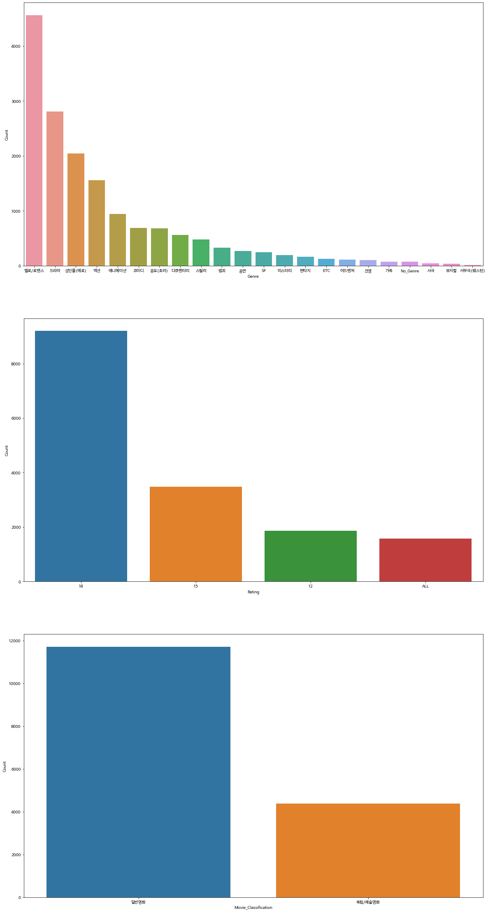
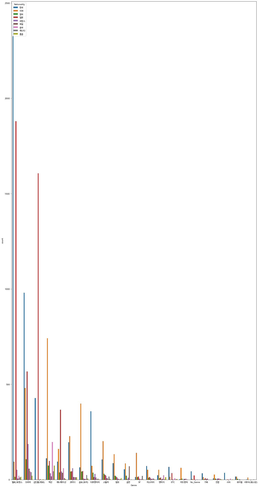
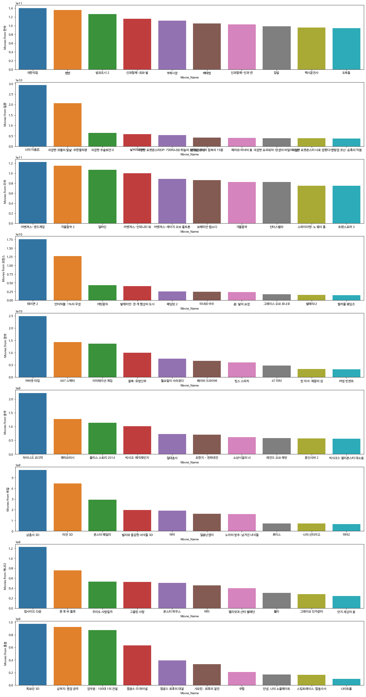

## 1. 각 국가 영화별 국내관객 분포 비교분석
* 'National_Audience' (전국 관객)
* 'National_number_screens' (전국 스크린 수)
* 'National_Sales' (전국 매출액)
* 'National_Audience' (전국 관객)
* 'Seoul_Sales' (서울 매출액)
* 'Seoul_Audience' (서울 관객)

* 장르
* 연령
* 독립영화/ 일반영화

## 2. 주요 국가 영화별 장르 분포 

## 3. 주요 국가 영화별 연령 제한 분포 비교

## 4. 주요 국가 영화별 인기 top10 영화

## 5. 국내 개봉 영화 국가별 워드 클라우드

## 6. 연도에 따른 주요 국가별 영화 개봉수 추이

## 7. 국가별 국내 개봉 영화 분포 비교 

## 8. 연도별 변화 비교분석
### : 'National_Sales', 'National_Audience', 'Release_Year'

* [연도별 장르 수요 추이]

* [연도별 전국 관객 추이]

## 9. 장르별 변화 비교 분석 
### : 'National_Sales', 'National_Audience', 'Genre'

* [장르별 국내 관객 비교] 

* [장르별 국내 매출액 변화 비교] 

## 10. 연도별 전국 관객 장르 수요 분석
###  :'National_Audience','year', 'Genre'

* [연도별 국내개봉 영화 장르 관객 분포 비교]

*  [연도별 국내개봉 영화 장르 관객 분포(비율)]
